# AI-Driven Design Workflow System

**AI 驱动的室内设计工作流系统**

一个基于 AI 智能体的模块化设计工作流系统,通过 6 个专业智能体实现从项目分析到最终交付的完整设计流程。

[](https://opensource.org/licenses/MIT)
[]()
[]()

---

## 📖 目录

- [系统概述](#系统概述)
- [核心特性](#核心特性)
- [系统架构](#系统架构)
- [6 个核心智能体](#6-个核心智能体)
- [使用逻辑](#使用逻辑)
- [快速开始](#快速开始)
- [完整工作流示例](#完整工作流示例)
- [案例学习系统](#案例学习系统)
- [项目结构](#项目结构)
- [技术文档](#技术文档)
- [贡献指南](#贡献指南)
- [许可证](#许可证)

---

## 系统概述

本系统将复杂的室内设计任务解构为 6 个具有独立职能的"AI 智能体专家",每个智能体采用特定的提示词框架,协同完成从概念到交付的完整设计流程。

### 设计理念

- **模块化**: 每个智能体独立且可复用
- **框架驱动**: 基于成熟的提示词框架(BROKE, COSTAR, RTGO, CARE, RTF, ROSES)
- **可学习**: 通过 TRACE 框架学习优秀案例
- **可扩展**: 易于添加新功能和知识
- **专业性**: 符合设计行业实际工作流程

---

## 核心特性

### ✨ 6 个专业智能体

1. **方案资讯官** - 项目前期分析和策略制定
2. **彩平绘制师** - CAD 线框图转彩色平面图
3. **三维建模师** - 2D 平面图转 3D 透视空间
4. **视觉艺术家** - 材质迁移和风格控制
5. **杂志摄影师** - 摄影级渲染和镜头控制
6. **软装排版师** - 方案排版和物料整理

### 🎯 完整工作流

```
项目需求 → 策略分析 → 彩色平面图 → 3D 建模 → 风格渲染 → 摄影优化 → 方案交付
```

### 📚 案例学习系统

- **TRACE 框架**: 系统化学习优秀设计案例
- **知识卡片**: 将案例转化为可复用的参数
- **实时更新**: 学习成果直接应用到智能体

### 🎨 已验证功能

- ✅ CAD 转彩色平面图(真实渲染风格)
- ✅ 岁集风格茶室设计
- ✅ 岁集风格私密包厢设计
- ✅ 案例学习和知识提取

---

## 系统架构

### 三层架构

```
┌─────────────────────────────────────────┐
│         知识层 (Knowledge Layer)         │
│  - 知识分发总监 (Data Librarian)         │
│  - TRACE 学习框架                        │
│  - 案例库 & 知识卡片                     │
└─────────────────────────────────────────┘
                    ↓
┌─────────────────────────────────────────┐
│        智能体层 (Agent Layer)            │
│  6 个核心智能体 (详见下文)               │
└─────────────────────────────────────────┘
                    ↓
┌─────────────────────────────────────────┐
│      输入/输出层 (I/O Layer)             │
│  - 项目需求 → 完整方案                   │
│  - CAD 图纸 → 效果图                     │
│  - 参考案例 → 知识卡片                   │
└─────────────────────────────────────────┘
```

### 数据流图

```mermaid
graph LR
    A[用户需求] --> B[方案资讯官]
    B --> C[彩平绘制师]
    C --> D[三维建模师]
    D --> E[视觉艺术家]
    E --> F[杂志摄影师]
    F --> G[软装排版师]
    G --> H[最终交付]
    
    I[案例学习] --> J[TRACE 框架]
    J --> K[知识卡片]
    K -.更新.-> B
    K -.更新.-> C
    K -.更新.-> D
    K -.更新.-> E
    K -.更新.-> F
    K -.更新.-> G
```



---

## 6 个核心智能体

### 1. 方案资讯官 (The Analyst)

**框架**: BROKE (Background-Role-Objectives-Key Results-Evolve)

**功能**:
- 项目背景和竞争分析
- 用户画像和需求分析
- 设计目标和 KPI 设定
- 演变路径规划

**输入**: 项目需求、市场信息
**输出**: 策略报告、用户画像、KPI 指标

**使用示例**:
```
请帮我分析一个 150 平米的咖啡馆项目,位于商务区
```

---

### 2. 彩平绘制师 (The Draftsman)

**框架**: COSTAR (Context-Objective-Style-Tone-Audience-Response)

**功能**:
- CAD 线框图转彩色平面图
- 材质纹理表达
- 阴影和光影渲染
- 动线引导标注

**输入**: CAD 图纸、设计策略
**输出**: 高质量彩色平面图

**使用示例**:
```
请为这个 CAD 图纸生成彩色平面图,现代简约风格
```

---

### 3. 三维建模师 (The Architect)

**框架**: RTGO (Role-Task-Goal-Operation)

**功能**:
- 2D 平面图转 3D 透视空间
- 空间体量控制
- ControlNet 技术应用
- 透视关系校正

**输入**: 彩色平面图、视角要求
**输出**: 3D 透视效果图

**使用示例**:
```
请生成客厅视角的 3D 透视图,人眼高度
```

---

### 4. 视觉艺术家 (The Stylist)

**框架**: CARE (Context-Action-Result-Example)

**功能**:
- 材质替换和优化
- 灯光氛围调整
- 艺术风格统一
- 色彩和谐控制

**输入**: 3D 效果图、风格要求
**输出**: 优化后的风格化效果图

**使用示例**:
```
请调整为温暖的黄昏氛围,北欧风格
```

---

### 5. 杂志摄影师 (The Photographer)

**框架**: RTF (Role-Task-Format)

**功能**:
- 摄影参数控制(焦段 16-85mm)
- 光圈和景深(f/1.4-f/16)
- 构图优化(三分法则、黄金分割)
- 移轴透视修正

**输入**: 风格化效果图、摄影要求
**输出**: 杂志级摄影渲染

**使用示例**:
```
请用 50mm 镜头,f/2.8 光圈,拍摄杂志级照片
```

---

### 6. 软装排版师 (The Curator)

**框架**: ROSES (Role-Objective-Scenario-Expected Solution-Steps)

**功能**:
- 单品提取和编号
- 物料清单生成
- 方案排版设计
- 多格式输出

**输入**: 摄影级渲染图、项目信息
**输出**: 方案册、物料清单、预算表

**使用示例**:
```
请生成完整的方案册和物料清单
```

---

## 使用逻辑

### 基本使用流程

#### 1. 单独使用某个智能体

适用于只需要某个特定功能的场景:

```
# 只需要彩平图
请为这个 CAD 图纸生成彩色平面图

# 只需要项目分析
请帮我分析这个咖啡馆项目
```

#### 2. 顺序使用多个智能体

适用于完整项目流程:

```
步骤 1: 请帮我分析一个咖啡馆项目 (方案资讯官)
步骤 2: 请为这个 CAD 生成彩平图 (彩平绘制师)
步骤 3: 请生成 3D 效果图 (三维建模师)
步骤 4: 请调整为温暖氛围 (视觉艺术家)
步骤 5: 请生成杂志级照片 (杂志摄影师)
步骤 6: 请生成方案册 (软装排版师)
```

#### 3. 案例学习模式

学习优秀案例并应用到新项目:

```
步骤 1: 分享案例链接或图片
步骤 2: 系统自动使用 TRACE 框架学习
步骤 3: 提取知识卡片并更新智能体
步骤 4: 使用学到的风格设计新项目
```

### 高级使用技巧

#### 指定具体参数

```
请用岁集风格设计一个茶室:
- 地面: 深灰剁斧石
- 天花: 浅色木格栅
- 灯光: 3000K 暖白
- 色彩: 深灰 40% + 浅木 35% + 米白 20%
```

#### 多角度生成

```
请为这个空间生成 3 个角度的效果图:
1. 入口视角 (24mm 广角)
2. 客厅视角 (50mm 标准)
3. 细节特写 (85mm 中焦)
```

#### 风格迁移

```
请将这个空间从现代风格转换为岁集风格,
保持布局不变,只调整材质和灯光
```

---

## 快速开始

### 前置要求

- AI 对话系统(如 Claude、ChatGPT 等)
- 支持 Markdown 和 Mermaid 的文档查看器(可选)

### 安装

1. **克隆仓库**:
```bash
git clone https://github.com/yourusername/ai-design-workflow.git
cd ai-design-workflow
```

2. **查看 Skills**:
```bash
ls -la skills/
```

3. **阅读文档**:
```bash
# 系统架构
open docs/system-architecture.md

# 使用指南
open docs/user-guide.md
```

### 第一个项目

#### 示例 1: 生成彩色平面图

```
1. 准备 CAD 图纸
2. 对 AI 说: "请为这个 CAD 图纸生成彩色平面图,现代简约风格"
3. 获得专业的彩色平面图
```

#### 示例 2: 完整项目流程

```
1. 项目分析: "请分析一个 150 平米咖啡馆项目"
2. 生成彩平: "请为 CAD 图生成彩平图"
3. 3D 建模: "请生成客厅视角 3D 图"
4. 风格优化: "请调整为温暖氛围"
5. 摄影渲染: "请生成杂志级照片"
6. 方案交付: "请生成完整方案册"
```

---

## 完整工作流示例

### 案例: 岁集风格茶室设计

#### 1. 案例学习阶段

```
输入: 岁集院子案例链接
处理: TRACE 框架自动学习
输出: 知识卡片(材质、色彩、灯光参数)
```

**提取的核心参数**:
- 地面: 深灰剁斧石 (#4A5568)
- 天花: 浅色木格栅 (#D4A574)
- 灯光: 3000K 暖白 + 2700K 暖黄
- 色彩: 深灰 40% + 浅木 35% + 米白 20% + 墨绿 5%

#### 2. 设计应用阶段

```
需求: 设计一个岁集风格的茶室

智能体协作:
1. 方案资讯官: 分析茶室功能和目标人群
2. 彩平绘制师: 生成平面布局
3. 三维建模师: 创建 3D 空间
4. 视觉艺术家: 应用岁集材质和灯光
5. 杂志摄影师: 优化视觉效果
6. 软装排版师: 生成方案文档

输出: 完整的岁集风格茶室方案
```

#### 3. 实际效果

- ✅ 材质 100% 还原岁集风格
- ✅ 色彩配比精确匹配
- ✅ 灯光氛围完美复现
- ✅ 空间气质高度一致

---

## 案例学习系统

### TRACE 学习框架

**T**ask - 提取核心设计语言
**R**equest - 转化为量化参数
**A**ction - 封装为知识卡片
**C**ontext - 关联智能体环境
**E**xample - 生成参考样张

### 学习流程

```mermaid
graph TD
    A[输入案例] --> B[TRACE 分析]
    B --> C[提取设计语言]
    C --> D[量化参数]
    D --> E[生成知识卡片]
    E --> F[更新智能体]
    F --> G[应用到新项目]
```



### 已学习案例

#### 岁集院子 (Suiji Courtyard)

**风格**: 当代东方 / 侘寂美学

**核心参数**:
- 材质: 深灰剁斧石 + 浅色木格栅
- 色彩: #4A5568 + #D4A574 + #F5F5F0 + #2D5016
- 灯光: 3000K 主光 + 2700K 重点光
- 空间: 回字形中庭 + 竹林景观

**应用场景**:
- 高端餐饮空间
- 精品酒店民宿
- 茶室会所
- 文化艺术空间

**查看详情**: [案例学习报告](docs/case-studies/suiji-courtyard.md)

---

## 项目结构

```
ai-design-workflow/
├── README.md                          # 本文件
├── LICENSE                            # MIT 许可证
├── .gitignore                         # Git 忽略文件
│
├── skills/                            # 6 个核心 Skills
│   ├── design-analyst/                # 方案资讯官
│   │   └── SKILL.md
│   ├── design-draftsman/              # 彩平绘制师
│   │   └── SKILL.md
│   ├── design-architect/              # 三维建模师
│   │   └── SKILL.md
│   ├── design-stylist/                # 视觉艺术家
│   │   └── SKILL.md
│   ├── design-photographer/           # 杂志摄影师
│   │   └── SKILL.md
│   └── design-curator/                # 软装排版师
│       └── SKILL.md
│
├── docs/                              # 文档目录
│   ├── system-architecture.md         # 系统架构文档
│   ├── user-guide.md                  # 使用指南
│   ├── framework-reference.md         # 框架参考
│   ├── case-studies/                  # 案例学习
│   │   └── suiji-courtyard.md
│   └── api-reference.md               # API 参考
│
├── examples/                          # 示例项目
│   ├── coffee-shop/                   # 咖啡馆案例
│   ├── tearoom/                       # 茶室案例
│   └── residential/                   # 住宅案例
│
├── knowledge-base/                    # 知识库
│   ├── materials/                     # 材质库
│   ├── lighting/                      # 灯光库
│   ├── styles/                        # 风格库
│   └── cases/                         # 案例库
│
└── tools/                             # 辅助工具
    ├── trace-analyzer.py              # TRACE 分析工具
    └── knowledge-card-generator.py    # 知识卡片生成器
```

---

## 技术文档

### 详细文档

- [系统架构](docs/system-architecture.md) - 完整的系统架构说明
- [使用指南](docs/user-guide.md) - 详细的使用教程
- [深度实践](https://blog.csdn.net/2604_95183339/article/details/157807783) - CSDN 详细解析文章
- [框架参考](docs/framework-reference.md) - 6 种提示词框架详解
- [案例学习](docs/case-studies/) - 已学习案例的详细报告
- [API 参考](docs/api-reference.md) - 智能体接口说明

### 可视化架构

完整的系统架构可视化图表:
- 系统总览架构图
- 工作流时序图
- 提示词框架映射
- 知识分发机制
- 摄影美学控制
- 智能体详细架构
- 系统数据流图

查看: [system-architecture.html](docs/system-architecture.html)

---

## 贡献指南

我们欢迎所有形式的贡献!

### 如何贡献

1. **Fork 本仓库**
2. **创建特性分支** (`git checkout -b feature/AmazingFeature`)
3. **提交更改** (`git commit -m 'Add some AmazingFeature'`)
4. **推送到分支** (`git push origin feature/AmazingFeature`)
5. **开启 Pull Request**

### 贡献方向

- 🎨 **新的 Skills**: 添加新的智能体
- 📚 **案例学习**: 分享优秀设计案例
- 🔧 **工具开发**: 开发辅助工具
- 📖 **文档完善**: 改进文档和示例
- 🐛 **Bug 修复**: 报告和修复问题

---

## 路线图

### v1.0 (当前版本)

- ✅ 6 个核心 Skills 完整实现
- ✅ TRACE 案例学习框架
- ✅ 岁集院子案例学习
- ✅ 完整文档和示例

### v1.1 (计划中)

- ⏳ 知识分发总监智能体
- ⏳ 更多设计风格案例
- ⏳ Scripts 辅助工具
- ⏳ References 参考资料库

### v2.0 (未来)

- 🔮 ControlNet 集成
- 🔮 自动化工作流
- 🔮 多语言支持
- 🔮 Web 界面

---

## 常见问题

### Q: 这个系统需要什么技术基础?

A: 只需要会使用 AI 对话系统(如 Claude、ChatGPT),不需要编程基础。

### Q: 可以用于商业项目吗?

A: 可以,本项目采用 MIT 许可证,可自由用于商业用途。

### Q: 如何学习新的设计案例?

A: 只需提供案例链接或图片,系统会自动使用 TRACE 框架学习并生成知识卡片。

### Q: 支持哪些设计风格?

A: 系统支持任何风格,已验证的包括:现代简约、北欧、工业、轻奢、日式、当代东方等。

### Q: 生成的效果图质量如何?

A: 已验证可生成杂志级质量的效果图,包括真实材质、准确比例、专业光影。

---

## 致谢

感谢以下项目和资源的启发:

- [Anthropic Claude](https://www.anthropic.com/) - AI 对话系统
- [Mermaid](https://mermaid.js.org/) - 图表可视化
- 岁集院子 - 优秀的设计案例

---

## 许可证

本项目采用 MIT 许可证 - 查看 [LICENSE](LICENSE) 文件了解详情。

---

## 联系方式

- **项目主页**: https://github.com/yourusername/ai-design-workflow
- **问题反馈**: https://github.com/yourusername/ai-design-workflow/issues
- **讨论区**: https://github.com/yourusername/ai-design-workflow/discussions

---

**⭐ 如果这个项目对你有帮助,请给我们一个 Star!**

---

*最后更新: 2026-02-05*
