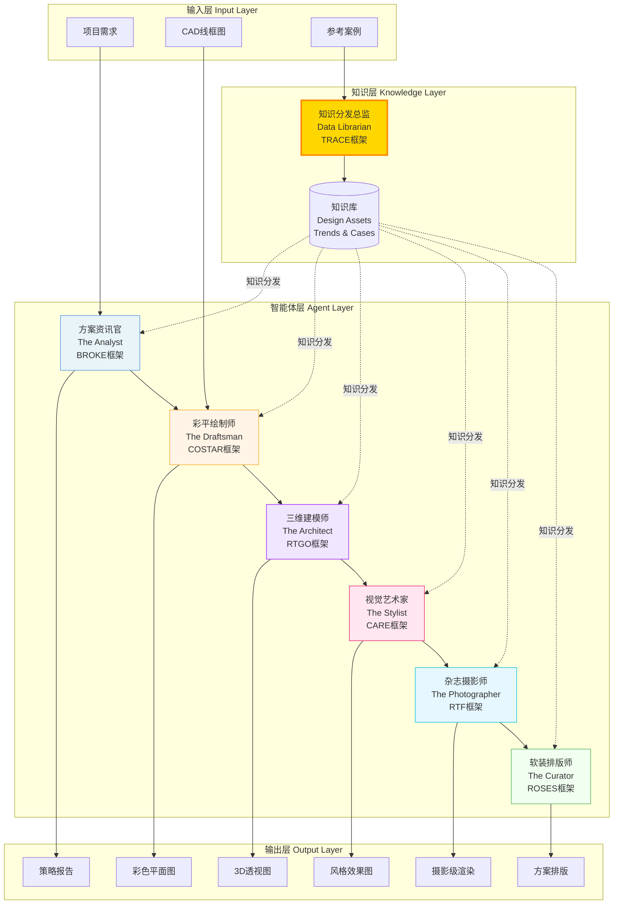
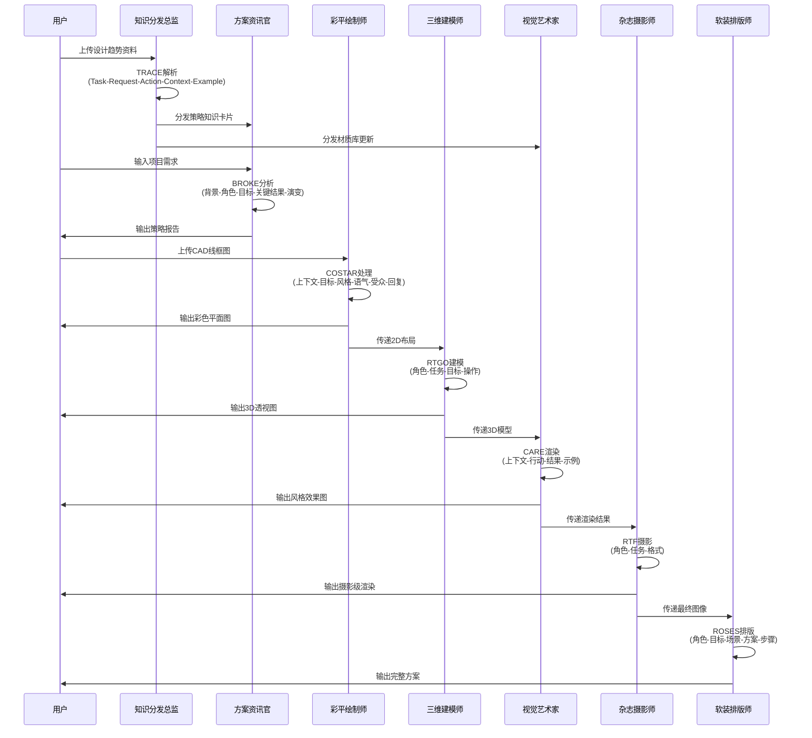
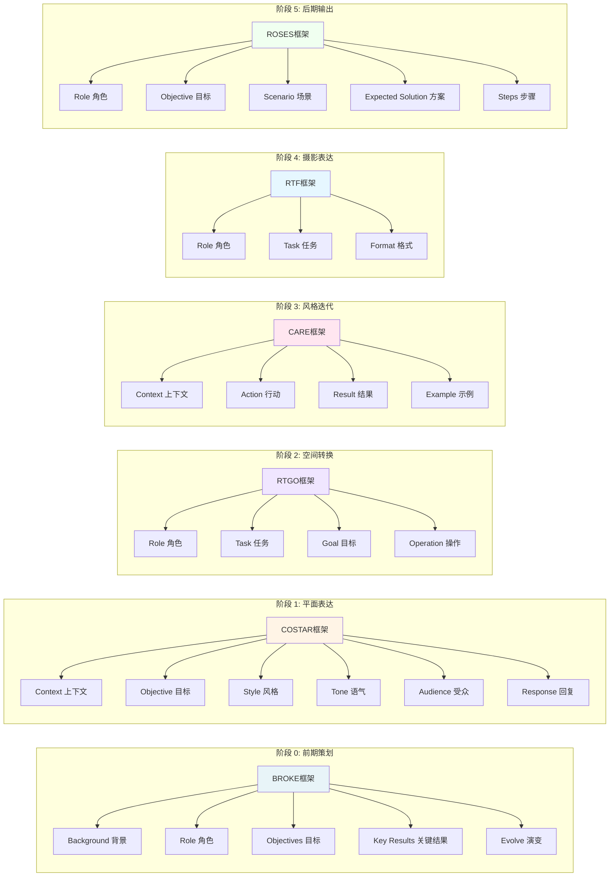
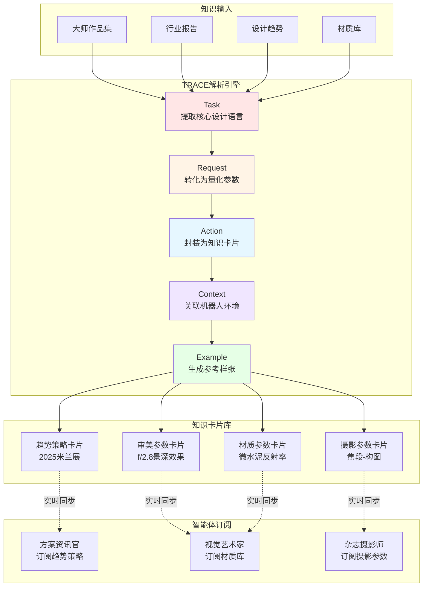
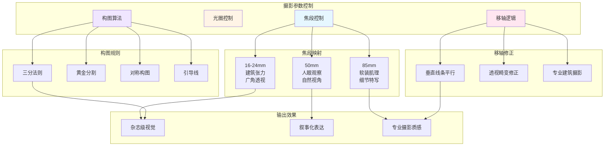
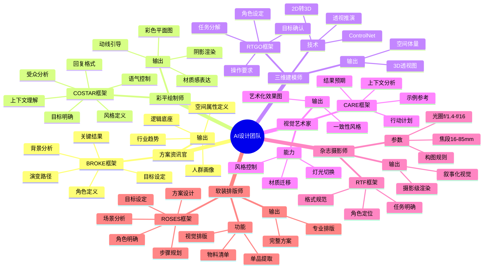
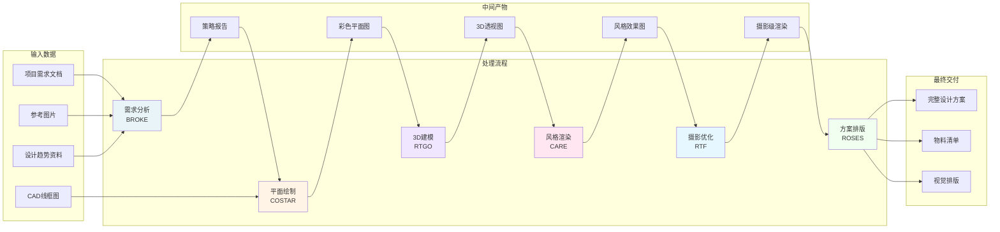

# AI 驱动设计工作流系统架构

## 1. 系统总览架构图

## 2. 工作流时序图

## 3. 提示词框架映射矩阵

## 4. 知识分发机制 (TRACE)

## 5. 摄影美学控制系统

## 6. 六大智能体详细架构

## 7. 系统数据流图

---

## 图表说明

### 1. 系统总览架构图
展示了整个系统的三层架构:知识层、智能体层、输入输出层,以及它们之间的数据流动关系。

### 2. 工作流时序图
详细描述了从用户输入到最终交付的完整时序流程,包括各智能体之间的协作关系。

### 3. 提示词框架映射矩阵
将21种提示词框架中的6种核心框架映射到对应的设计阶段,展示每个框架的具体组成要素。

### 4. 知识分发机制
展示TRACE框架如何将外部知识转化为可执行的参数卡片,并分发给相应的智能体。

### 5. 摄影美学控制系统
详细说明摄影参数(焦段、光圈、构图、移轴)如何控制最终的视觉输出质量。

### 6. 六大智能体详细架构
使用思维导图形式展示每个智能体的框架、能力和输出。

### 7. 系统数据流图
从数据角度展示整个系统的输入、处理、中间产物和最终交付的流转过程。

---

**使用说明**: 这些 Mermaid 图表可以直接在支持 Mermaid 的 Markdown 编辑器中渲染,如 Obsidian、Typora、GitHub 等。
